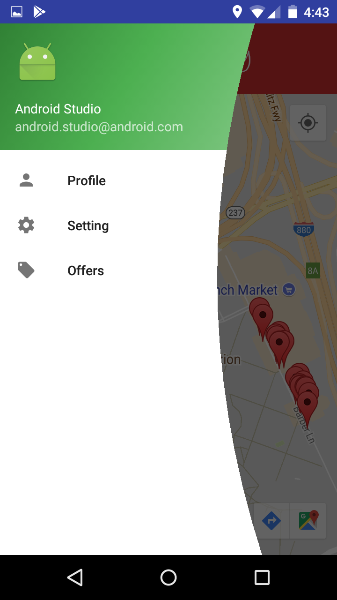
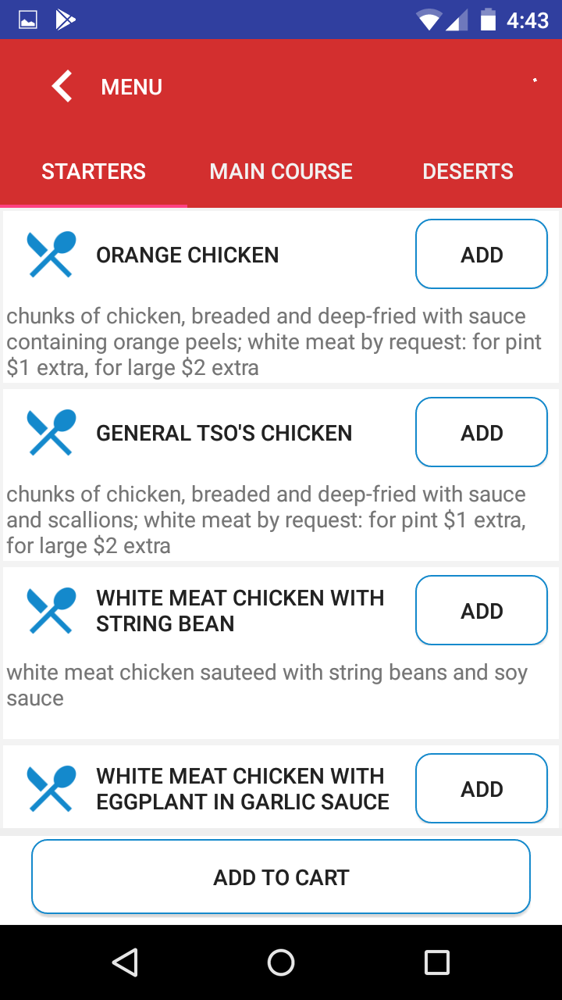
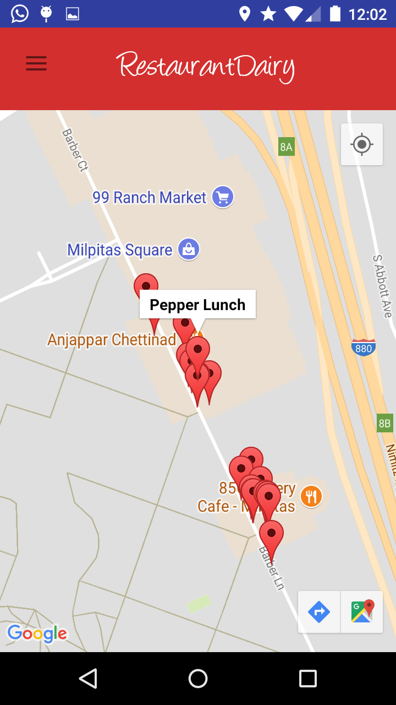
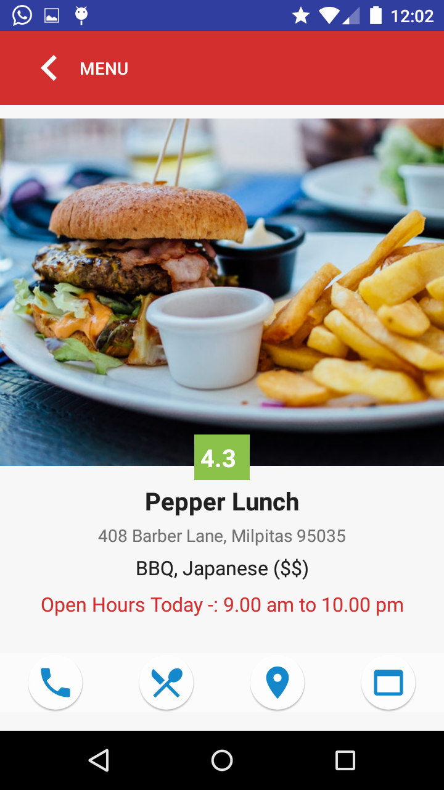
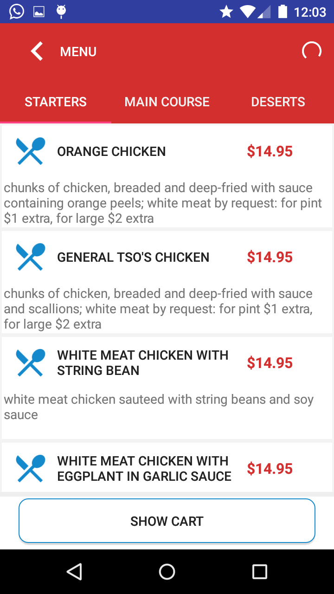
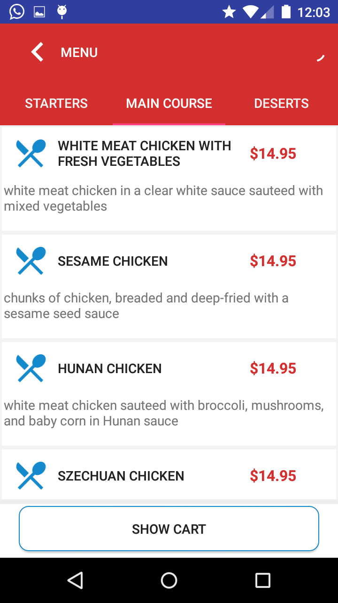
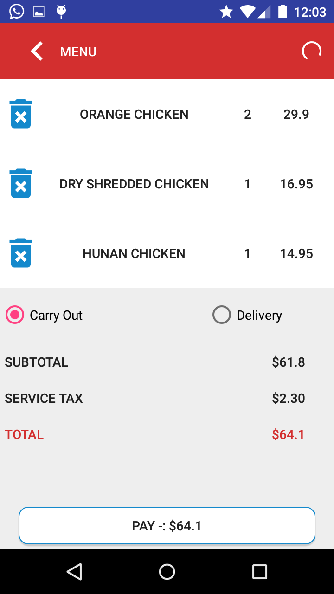
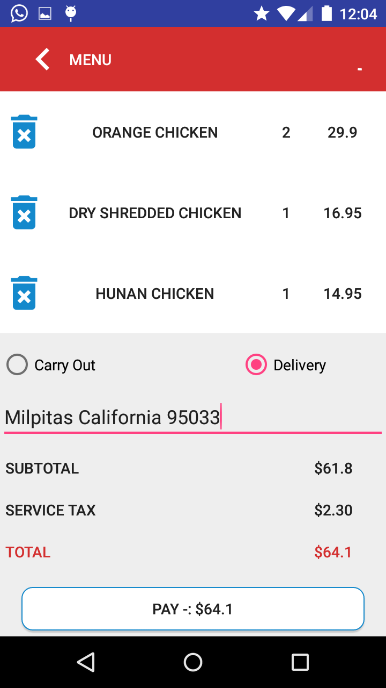
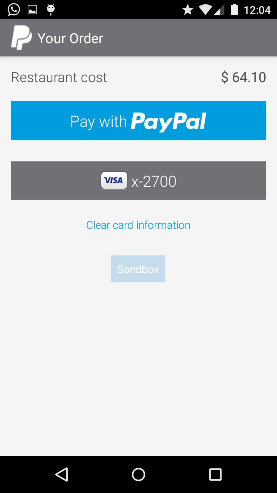
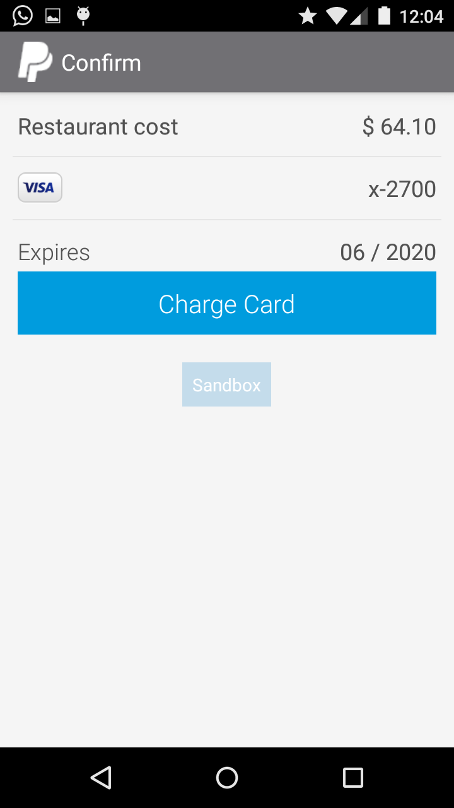

## RestaurantApp
Purchase  food you want, from the restaurants you love. 
Purchase using  Card or through PayPal Account directly.

## API Reference
#https://google.github.io/dagger/  
#http://square.github.io/retrofit/  
#https://github.com/ReactiveX/RxJava/wiki/The-RxJava-Android-Module  
#https://medium.com/@cervonefrancesco/model-view-presenter-android-guidelines-94970b430ddf  

## ScrrenShot

  

 

 

## License

A short snippet describing the license (MIT, Apache, etc.)
